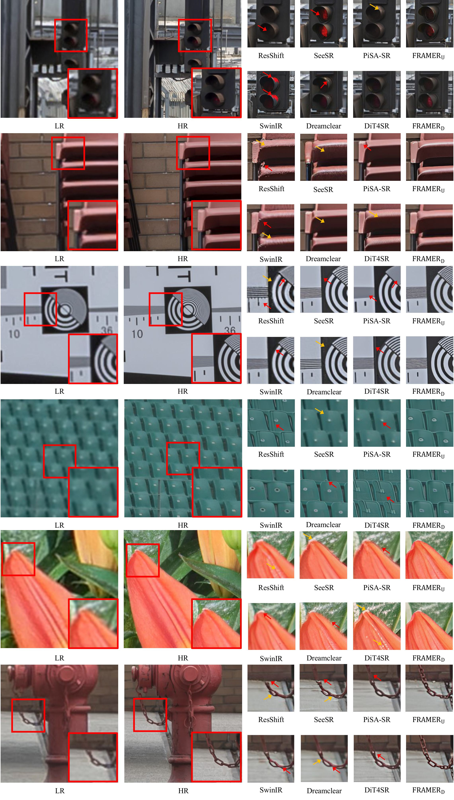
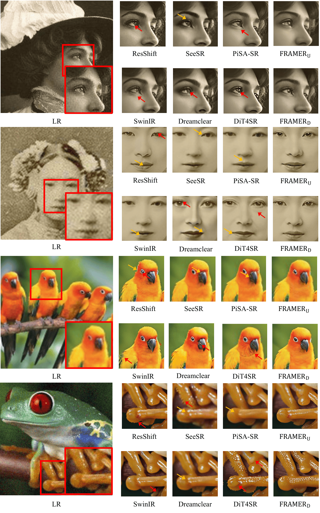

<div align="center">

<h2>🖼️ FRAMER</h2>

<div>&nbsp;&nbsp;
    <a href='mailto:choiseungho1019@gmail.com' target='_blank'>Seungho Choi</a><sup>1</sup>&nbsp;
    <a href='mailto:jhseong@cau.ac.kr' target='_blank'>Jeahun Sung</a><sup>1</sup>&nbsp;
    <a href='https://cmlab-korea.github.io/' target='_blank'>Jihyong Oh</a><sup>† 1</sup>
</div>

<div>
    <sup>1</sup>Chung-Ang University, South Korea
</div>
<div>
    <sup>†</sup>Corresponding author
</div>
</div>

<div align="center">
    <h4 align="center">
        <a href="https://cmlab-korea.github.io/FRAMER/" target='_blank'>
        
        </a>
        <a href="https://arxiv.org/abs/2512.01390" target='_blank'>
        
        </a>
        
    </h4>
</div>

---

<div align="center">
    <h4>
        This repository is the official implementation of "FRAMER: Frequency-Aligned Self-Distillation with Adaptive Modulation Leveraging Diffusion Priors for Real-World Image Super-Resolution".
    </h4>
</div>

<div align="center">
    
    <p>
        👆 <b>Qualitative Comparison:</b> Our FRAMER models produce sharper edges and richer details, leading to more visually natural restoration results.
    </p>
</div>

---

## 📑 Table of Contents

- [📧 News](#-news)
- [📖 Abstract](#-abstract)
- [🖼️ Method Overview](#️-method-overview)
  - [💡 Intuition](#-intuition)
  - [⚙️ Key Components](#️-key-components)
- [🔧 Dependencies and Installation](#-dependencies-and-installation)
- [🚀 Get Started](#-get-started)
  - [Training](#training)
    - [Download Checkpoints](#download-checkpoints)
    - [Download Train Datasets](#download-train-datasets)
    - [Start Train](#start-train)
  - [Testing](#testing)
- [🖼️ Large Image Inference Tips](#️-large-image-inference-tips)
  - [🔧 Key Arguments](#-key-arguments)
  - [💡 Guidelines](#-guidelines)
  - [⚡ Memory-Efficient](#-memory-efficient)
  - [🚀 High-Quality](#-high-quality)
- [📊 Qualitative Results](#-qualitative-results)
- [📦 Release Checklist](#-release-checklist)
- [🙏 Acknowledgements](#-acknowledgements)
- [📜 License](#-license)
- [📝 Citation](#-citation)
- [⭐ Star History](#-star-history)

---

## 📧 News

* **Feb 21, 2026:** FRAMER accepted to CVPR 2026 🥳
* **Dec 08, 2025:** Repository created.
* **Dec 08, 2025:** Paper available on [arXiv](https://arxiv.org/abs/2512.01390).

---

## 📖 Abstract

Real-image super-resolution (Real-ISR) seeks to recover HR images from LR inputs with mixed, unknown degradations. While diffusion models surpass GANs in perceptual quality, they often under-reconstruct high-frequency (HF) details due to a **low-frequency (LF) bias** and a depth-wise **"low-first, high-later" hierarchy**.

We introduce **FRAMER**, a plug-and-play training scheme that exploits diffusion priors without changing the backbone or inference. At each denoising step, the final-layer feature map teaches all intermediate layers. Teacher and student feature maps are decomposed into LF/HF bands via FFT masks to align supervision with the model's internal frequency hierarchy.

For LF, an **Intra Contrastive Loss (IntraCL)** stabilizes globally shared structure. For HF, an **Inter Contrastive Loss (InterCL)** sharpens instance-specific details using random-layer and in-batch negatives. Two adaptive modulators, **Frequency-based Adaptive Weight (FAW)** and **Frequency-based Alignment Modulation (FAM)**, reweight per-layer LF/HF signals and gate distillation by current similarity. Across U-Net and DiT backbones, FRAMER consistently improves PSNR/SSIM and perceptual metrics (LPIPS, NIQE, MANIQA, MUSIQ).

---

## 🖼️ Method Overview

FRAMER is a training-only framework that adds auxiliary loss components. It decomposes features into LF and HF bands and applies frequency-aligned contrastive losses.

<div align="center">
    
</div>

### 💡 Intuition

FRAMER improves diffusion-based SR by:
1. Separating features into low/high frequencies.
2. Teaching early layers using final-layer knowledge.
3. Applying different contrastive strategies for structure vs detail.

### ⚙️ Key Components

1. **IntraCL (Low-Frequency):** Stabilizes shared structures by comparing students only against the teacher and same-image random layers (no in-batch negatives).
2. **InterCL (High-Frequency):** Sharpens details using both random-layer negatives and in-batch negatives to encourage instance discrimination.
3. **FAW (Adaptive Weight):** Reweights distillation based on the relative frequency difference to the final layer.
4. **FAM (Alignment Modulation):** Gates distillation strength based on student-teacher alignment to prevent early training collapse.

---

## 🔧 Dependencies and Installation

1. Clone repo
    ```bash
    git clone [https://github.com/CMLab-Korea/FRAMER-arxiv.git](https://github.com/CMLab-Korea/FRAMER-arxiv.git)
    cd FRAMER-arxiv
    ```

2. Install packages
    ```bash
    pip install -r requirements.txt
    ```

---

## 🚀 Get Started

This project is a fork of the official [DiT4SR](https://github.com/adam-duan/DiT4SR) repository. Consequently, the core architecture, as well as the protocols for training and testing, strictly follow the methodologies and scripts provided in the original implementation.

### Training

#### Download Checkpoints

* Download the [stable-diffusion-3.5-medium](https://huggingface.co/stabilityai/stable-diffusion-3.5-medium) checkpoints.
* Download the [clip-vit-large-patch14-336](https://huggingface.co/openai/clip-vit-large-patch14-336) and [llava-v1.5-13b](https://huggingface.co/liuhaotian/llava-v1.5-13b) and update `CKPT_PTH.py` to include the local directory paths for the downloaded clip-vit-large-patch14-336 and llava-v1.5-13b models.

#### Download Train Datasets

* Download the training datasets including `DIV2K`, `DIV8K`, `Flickr2K`, `Flickr8K`, and `NKUSR8K` dataset.
* The data preparation process including LR-HR pair generation, prompt synthesis, and the extraction of latent codes and prompt embeddings is executed via the provided shell scripts in `bash_data/`.
    * Following [DiT4SR](https://github.com/adam-duan/DiT4SR), you can generate the LR-HR pairs for training using `bash_data/make_pairs.sh`.
    * Prompt Generation: Run `bash_data/make_prompt.sh` to synthesize prompts for HR images.
    * Latent Encoding: Execute `bash_data/make_latent.sh` to extract latent codes for HR and LR pairs.
    * Text Embedding: Use `bash_data/make_embedding.sh` to generate embeddings for the synthesized prompts.
* Data Structure After Preprocessing:

    ```python
    preset/datasets/training_datasets/ 
        └── gt
            └── 0000001.png # GT images
            └── ...
        └── sr_bicubic
            └── 0000001.png # Bicubic LR images
            └── ...
        └── prompt_txt
            └── 0000001.txt # prompts for teacher model and lora model
            └── ...
        └── prompt_embeds
            └── 0000001.pt # SD3 prompt embedding tensors
            └── ...
        └── pooled_prompt_embeds
            └── 0000001.pt # SD3 pooled embedding tensors
            └── ...
        └── latent_hr
            └── 0000001.pt # SD3 latent space tensors
            └── ...
        └── latent_lr
            └── 0000001.pt # SD3 latent space tensors
            └── ...
    ```

#### Start Train

Use the following command to start the training process.

If you want to get started quickly:
```bash
bash bash/train.sh
````

For detailed configuration:

```bash
accelerate launch --config_file multi-gpu.yaml train/train_dit4sr.py \
--pretrained_model_name_or_path="YOUR_PRETRAINED_MODEL_PATH" \
--output_dir="./experiments/dit4sr" \
--root_folders="preset/datasets/train_datasets" \
--mixed_precision="fp16" \
--learning_rate=5e-5 \
--train_batch_size=8 \
--gradient_accumulation_steps=1 \
--null_text_ratio=0.2 \
--dataloader_num_workers=0 \
--checkpointing_steps=10000 
```

### Testing

  * Place test images in `preset/datasets/test_datasets/`.

    ```bash
    # test w/o llava, one GPU is enough
    bash bash/test_wollava.sh

    # test w/ llava, two GPUs are required
    bash bash/test_wllava.sh
    ```

    ```bash
    CUDA_VISIBLE_DEVICES=0,1 python test/test_wllava.py \
    --pretrained_model_name_or_path="YOUR_PRETRAINED_MODEL_PATH" \
    --transformer_model_name_or_path="YOUR_TRAINED_MODEL_PATH" \
    --image_path="YOUR_TEST_DATASETS_PATH" \
    --output_dir="results/" \
    ```

  * The processed results will be saved in the `output_dir` directory.

  * The saved results can be evaluated using [pyiqa](https://github.com/chaofengc/IQA-PyTorch/tree/main) to compute PSNR, SSIM, LPIPS, NIQE, MANIQA, and MUSIQ metrics.

  * If you want to use a pretrained model, please download it from the link provided above.

-----

## 🖼️ Large Image Inference Tips

When processing high-resolution images, GPU memory can be a bottleneck.

### 🔧 Key Arguments

  * `--process_size`: base resolution (↓ memory, ↓ quality)
  * `--latent_tiled_size`: tile size (↓ memory, ↓ speed)
  * `--latent_tiled_overlap`: boundary smoothing
  * `--vae_encoder_tiled_size`: reduce if OOM
  * `--vae_decoder_tiled_size`: reduce for large outputs

### 💡 Guidelines

**OOM**

  * Reduce `process_size`
  * Reduce `latent_tiled_size`
  * Reduce `vae_encoder_tiled_size`

**High Quality**

  * Increase `process_size`
  * Increase overlap

### ⚡ Memory-Efficient

```bash
python test/test_wllava.py \
    --process_size 512 \
    --latent_tiled_size 32 \
    --latent_tiled_overlap 16
```

### 🚀 High-Quality

```bash
python test/test_wllava.py \
    --process_size 768 \
    --latent_tiled_size 64 \
    --latent_tiled_overlap 32
```

-----

## 📊 Qualitative Results

<div align="center">
    
</div>

<div align="center">
    
</div>

-----

## 📦 Release Checklist

  * [x] FRAMER-D code released
  * [ ] FRAMER-U code (coming soon)
  * [ ] FRAMER-D pretrained model (coming soon)
  * [ ] FRAMER-U pretrained model (coming soon)

-----

## 🙏 Acknowledgements

Our code is based on [DiT4SR](https://github.com/adam-duan/DiT4SR). We thank the authors for making their code publicly available.

## 📜 License

The source codes including the checkpoint can be freely used for research and education only. Any commercial use should get formal permission from the principal investigator (Prof. Jihyong Oh, jihyongoh@cau.ac.kr).


## 📝 Citation
If you find our work useful for your research, please consider citing:

```bibtex
@inproceedings{choi2026framer,
  title={FRAMER: Frequency-Aligned Self-Distillation with Adaptive Modulation Leveraging Diffusion Priors for Real-World Image Super-Resolution},
  author={Choi, Seungho and Sung, Jeahun and Oh, Jihyong},
  booktitle={Proceedings of the IEEE/CVF Conference on Computer Vision and Pattern Recognition (CVPR)},
  year={2026}
}
```

## ⭐ Star History

[](https://star-history.com/#cmlab-korea/FRAMER-arxiv&Date)
